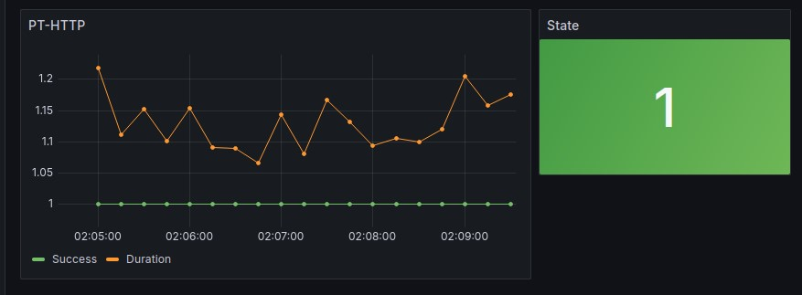

# INT-4_Task_3.-Monitoring
Этот репозиторий для третьего задания DevOps. Monitoring

## Запуск и просмотр:

Для запуска мониторинга неоходимо установить Docker и Docker Compose:

[Установка на Debian](https://docs.docker.com/engine/install/debian/)
[Установка на Ubuntu](https://docs.docker.com/engine/install/ubuntu/)

